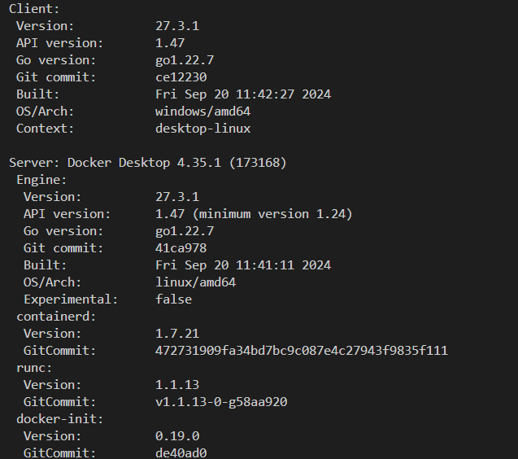
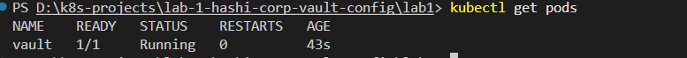
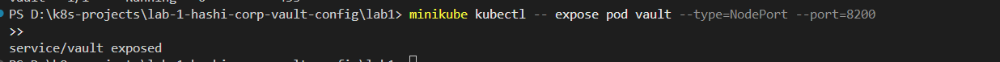
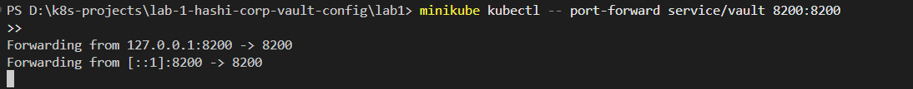
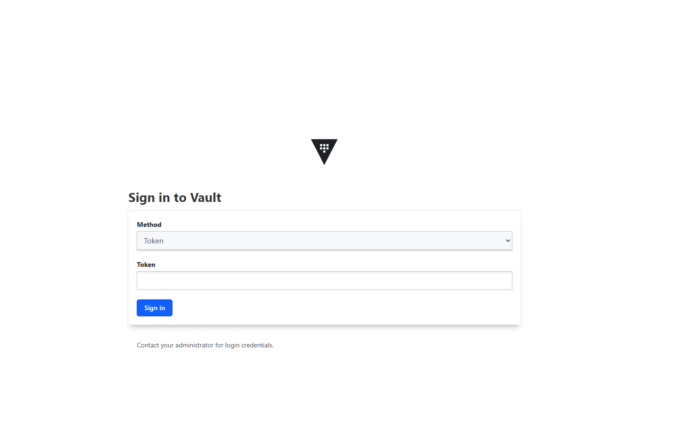
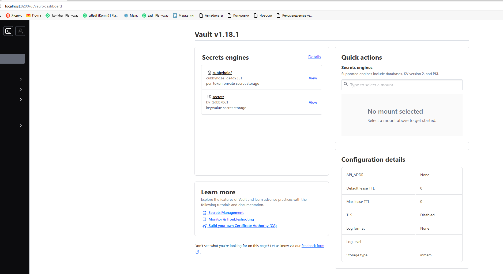

University: [ITMO University](https://itmo.ru/ru/) <br>
Faculty: [FICT](https://fict.itmo.ru) <br>
Course: [Introduction to distributed technologies](https://github.com/itmo-ict-faculty/introduction-to-distributed-technologies) <br>
Year: 2024/2025 <br>
Group: K4111c <br>
Author: Sadikov Maksim Andreevich <br>
Lab: [Лабораторная работа №1 "Установка Docker и Minikube, мой первый манифест."](https://itmo-ict-faculty.github.io/introduction-to-distributed-technologies/education/labs2023_2024/lab1/lab1/) <br>
Date of create: 14.11.2024 <br>
Date of finished: <br>

### Ход работы

Были установлены компоненты для выполнения лабораторной работы на Windows 11: **minikube**, **Docker**

```
docker version
```



```
minikube version
```


Для запуска кластера minikube была выполнена команда:

```
minikube start
```

Был написан манифест для образа HashiCorp Vault `vault-pod.yaml`

```
kind: Pod
apiVersion: v1
metadata:
  name: vault
  labels:
    app: vault
spec:
  containers:
    - name: vault-container
      image: hashicorp/vault:latest

```

После этого к кластеру был применен манифест командой и создан под командой:

```
kubectl apply -f vault-pod.yaml
```




После этого был создан сервис для доступа к контейнеру

```
minikube kubectl -- expose pod vault --type=NodePort --port=8200
```



И далее был настроен проброс порта для доступа на хосте

```
minikube kubectl -- port-forward service/vault 8200:8200
```



Для авторизации был использован токен из логов пода `minikube kubectl -- logs vault`





### Диаграмма контейнеров и сервисов


