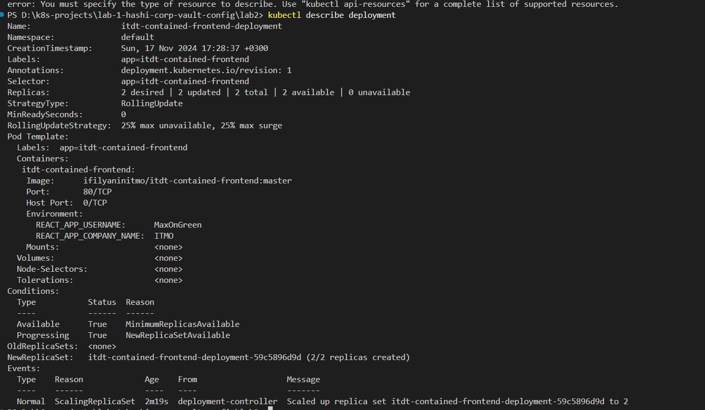
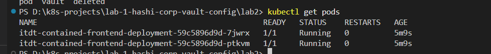
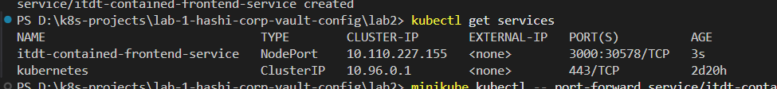
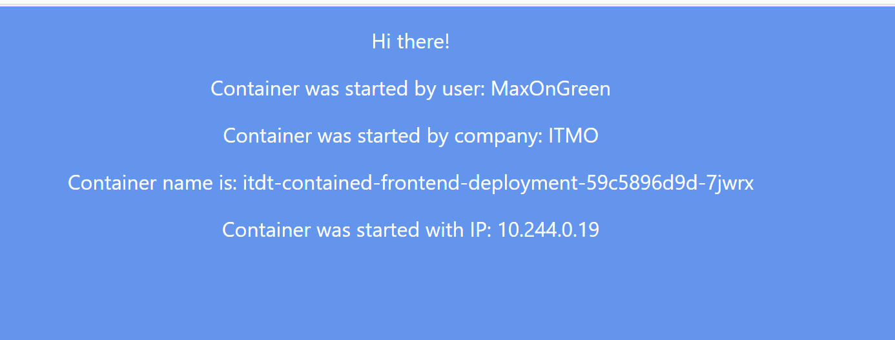
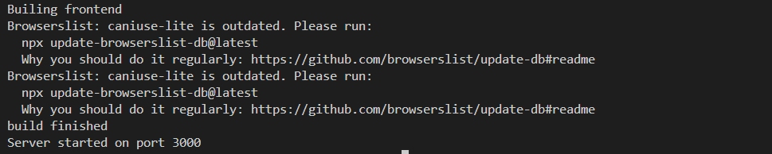
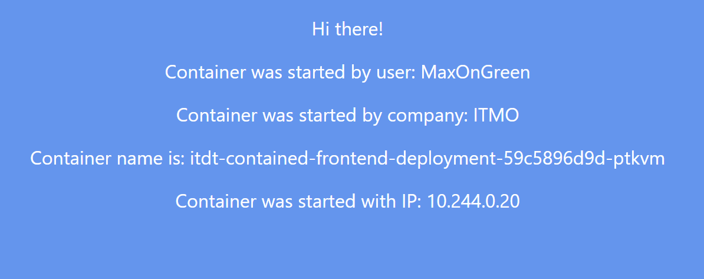
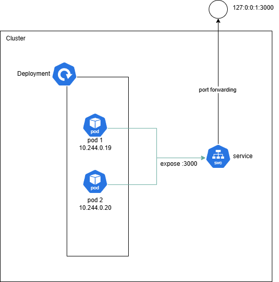

University: [ITMO University](https://itmo.ru/ru/) <br>
Faculty: [FICT](https://fict.itmo.ru) <br>
Course: [Introduction to distributed technologies](https://github.com/itmo-ict-faculty/introduction-to-distributed-technologies) <br>
Year: 2024/2025 <br>
Group: K4111c <br>
Author: Sadikov Maksim Andreevich <br>
Lab: [Лабораторная работа №2 "Развертывание веб сервиса в Minikube, доступ к веб интерфейсу сервиса. Мониторинг сервиса."](https://itmo-ict-faculty.github.io/introduction-to-distributed-technologies/education/labs2023_2024/lab2/lab2/) <br>
Date of create: 14.11.2024 <br>
Date of finished: <br>

### Ход работы

Командой `docker pull ifilyaninitmo/itdt-contained-frontend` был установлен контейнер

Был создан манифест для деплоймента с двумя репликами пода ifilyaninitmo/itdt-contained-frontend и заданнами переменными окружения `REACT_APP_USERNAME` и `REACT_APP_COMPANY_NAME`:

```
apiVersion: apps/v1
kind: Deployment
metadata:
  name: itdt-contained-frontend-deployment
  labels:
    app: itdt-contained-frontend
spec:
  replicas: 2
  selector:
    matchLabels:
      app: itdt-contained-frontend
  template:
    metadata:
      labels:
        app: itdt-contained-frontend
    spec:
      containers:
        - name: itdt-contained-frontend
          image: ifilyaninitmo/itdt-contained-frontend:master
          env:
            - name: REACT_APP_USERNAME
              value: "MaxOnGreen"
            - name: REACT_APP_COMPANY_NAME
              value: "ITMO"
          ports:
            - containerPort: 80

```

Также был написан манифест сервиса для доступа к подам:

```
apiVersion: v1
kind: Service
metadata:
  name: itdt-contained-frontend-service
spec:
  type: NodePort
  selector:
    app: itdt-contained-frontend
  ports:
    - port: 3000

```

Командой `kubectl apply -f service.yaml` и `kubectl apply -f deployment.yaml` были применены конфигурации к кластеру





Далее был открыт 3000 порт для доступа к контейнеру на хосте командой `minikube kubectl -- port-forward service/itdt-contained-frontend-service 3000:3000`



User и company соответствуют переданным env переменным

Логи контейнеров:


При удалении одного из подов командой `kubectl delete pod <pod-name>` сервис переключается на другой pod и меняется `Container name`



Схема организации контейнеров:

