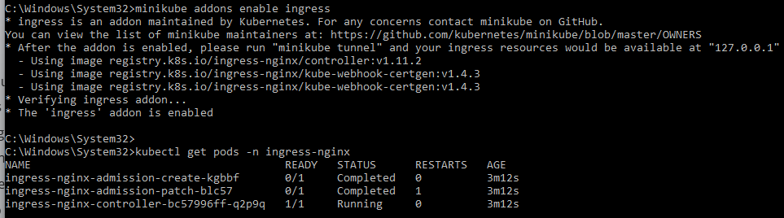
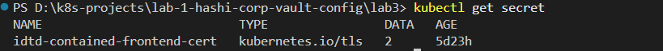
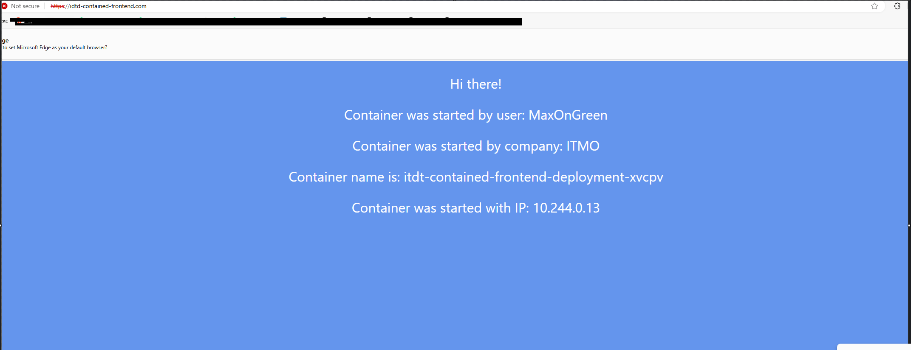
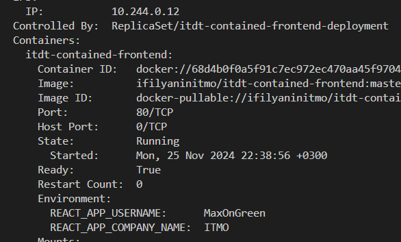
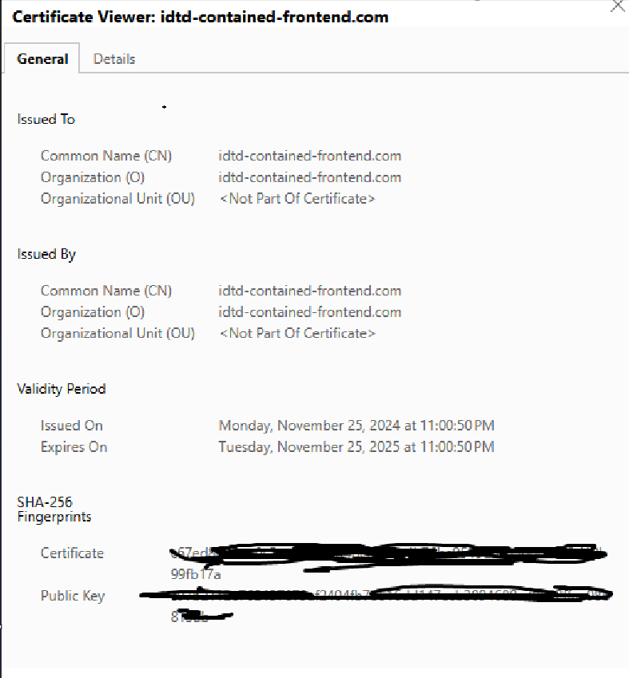
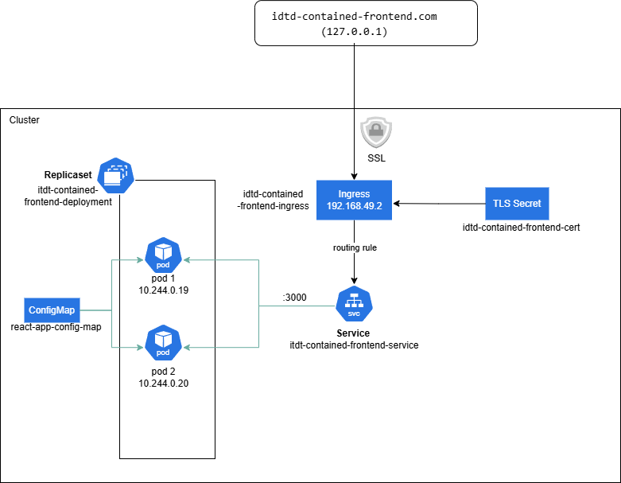

University: [ITMO University](https://itmo.ru/ru/) <br>
Faculty: [FICT](https://fict.itmo.ru) <br>
Course: [Introduction to distributed technologies](https://github.com/itmo-ict-faculty/introduction-to-distributed-technologies) <br>
Year: 2024/2025 <br>
Group: K4111c <br>
Author: Sadikov Maksim Andreevich <br>
Lab: [Лабораторная работа №3 "Сертификаты и "секреты" в Minikube, безопасное хранение данных.""](https://itmo-ict-faculty.github.io/introduction-to-distributed-technologies/education/labs2023_2024/lab3/lab3/) <br>
Date of create: 14.11.2024 <br>
Date of finished: <br>

### Ход работы

Был создан ConfigMap, содержащий переменные окружения `REACT_APP_USERNAME` и `REACT_APP_COMPANY_NAME`

```
apiVersion: v1
kind: ConfigMap
metadata:
  name: react-app-config-map
data:
  REACT_APP_USERNAME: "MaxOnGreen"
  REACT_APP_COMPANY_NAME: "ITMO"

```

Был применен ConfigMap командой `kubectl apply -f config-map.yaml`

Созданный ConfigMap передаётся в контейнер следующим образом:

```
  ...
  containers:
        - name: itdt-contained-frontend
          image: ifilyaninitmo/itdt-contained-frontend:master
          envFrom:
            - configMapRef:
                name: react-app-config-map
                ...
```

Также был написан манифест `replicaset` с двумя подами <br>

```
apiVersion: apps/v1
kind: ReplicaSet
metadata:
  name: itdt-contained-frontend-deployment
  labels:
    app: itdt-contained-frontend
spec:
  replicas: 2
  selector:
    matchLabels:
      app: itdt-contained-frontend
  template:
    metadata:
      labels:
        app: itdt-contained-frontend
    spec:
      containers:
        - name: itdt-contained-frontend
          image: ifilyaninitmo/itdt-contained-frontend:master
          ...
```

После этого был инициализирован NGINX контроллер командой `minikube addons enable ingress`



Далее был сгенерирован TSL сертификат командой
`openssl req -x509 -nodes -days 365 -newkey rsa:2048 -keyout tls.key -out tls.crt -subj "/CN=idtd-contained-frontend.com"
`
После создания сертификат был создан secret в minikube командой `kubectl create secret tls idtd-contained-frontend-cert --cert=tls.crt --key=tls.key`



Создание ingress:

```
apiVersion: networking.k8s.io/v1
kind: Ingress
metadata:
  annotations:
    nginx.ingress.kubernetes.io/service-upstream: "true"
  name: idtd-contained-frontend-ingress
spec:
  ingressClassName: nginx
  tls:
    - hosts:
        - idtd-contained-frontend.com
      secretName: idtd-contained-frontend-cert
  rules:
    - host: idtd-contained-frontend.com
      http:
        paths:
          - path: /
            backend:
              service:
                name: itdt-contained-frontend-service
                port:
                  number: 80
            pathType: ImplementationSpecific

```

В поле tls был указан ранее созданный secret:

```
tls:
    - hosts:
        - idtd-contained-frontend.com
      secretName: idtd-contained-frontend-cert
```

Редактирование файла hosts: `127.0.0.1 idtd-contained-frontend.com`

Для корректной работы ingress был использован tunnel командой `minikube tunnel`

Был применен ingress командой `kubectl apply -f ingress.yaml`

Запуск ReplicaSet и Deployment командами `kubectl apply -f service.yaml` и `kubectl apply -f replicaset.yaml`



Переменные из созданного ConfigMap:


Сертификат:


Диаграмма контейнеров:

