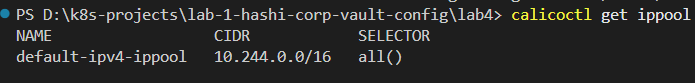
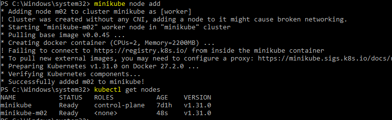
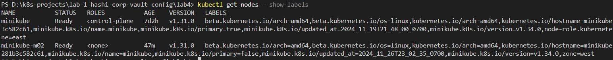
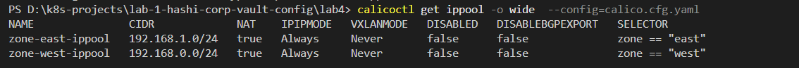
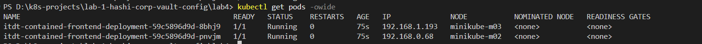
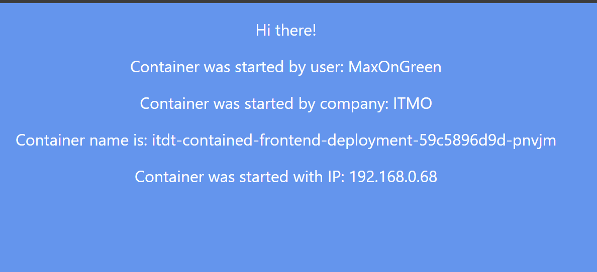
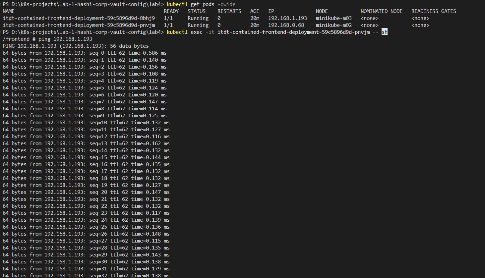
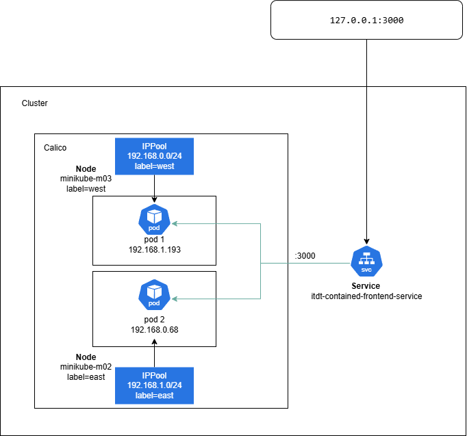

University: [ITMO University](https://itmo.ru/ru/) <br>
Faculty: [FICT](https://fict.itmo.ru) <br>
Course: [Introduction to distributed technologies](https://github.com/itmo-ict-faculty/introduction-to-distributed-technologies) <br>
Year: 2024/2025 <br>
Group: K4111c <br>
Author: Sadikov Maksim Andreevich <br>
Lab: [Лабораторная работа №4 "Сети связи в Minikube, CNI и CoreDNS"](https://itmo-ict-faculty.github.io/introduction-to-distributed-technologies/education/labs2023_2024/lab4/lab4/) <br>
Date of create: 26.11.2024 <br>
Date of finished: <br>

### Ход работы

Для начала был запущен kubernetes командойд `minikube start --network-plugin=cni`

После этого был установлен плагин Calisto командой `kubectl apply -f https://raw.githubusercontent.com/projectcalico/calico/v3.29.1/manifests/calico.yaml`

Была проверена установка Calisto командой `kubectl get pods -l k8s-app=calico-node -A`




После этого была добавлена дополнительная нода командой `minikube node add`



Были присвоены label-ы нодам `kubectl label nodes minikube-m02 zone=west` и `kubectl label nodes minikube zone=east`



Далее были созданы манифесты плагина Calico с функцией IPAM

```
apiVersion: projectcalico.org/v3
kind: IPPool
metadata:
  name: zone-east-ippool
spec:
  cidr: 192.168.1.0/24
  ipipMode: Always
  natOutgoing: true
  nodeSelector: zone == "east"

----
apiVersion: projectcalico.org/v3
kind: IPPool
metadata:
  name: zone-west-ippool
spec:
  cidr: 192.168.0.0/24
  ipipMode: Always
  natOutgoing: true
  nodeSelector: zone == "west"

```

Был удален стандартный IPPool командой `calicoctl delete ippools default-ipv4-ippool`

После этого были применены ранее созданные манифесты `calicoctl apply -f east-ip-pool.yaml` и `calicoctl apply -f west-ip-pool.yaml`:



Командой `kubectl apply -f service.yaml` и `kubectl apply -f deployment.yaml` были применены конфигурации к кластеру

Включение режима проброса портов `minikube kubectl -- port-forward service/itdt-contained-frontend-service 3000:3000`



Адреса контейнеров соответствуют заданным в IPPool-ах правилам



Командой `kubectl exec -it itdt-contained-frontend-deployment-59c5896d9d-pnvjm -- sh` и `ping 192.168.1.0` был пропингован соседний под



Диаграмма контейнеров


